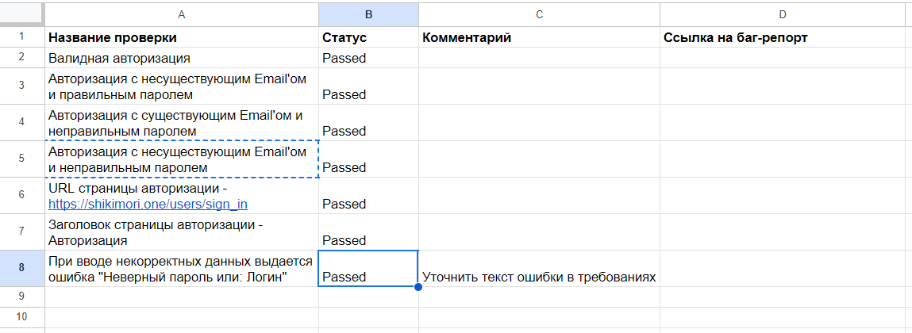
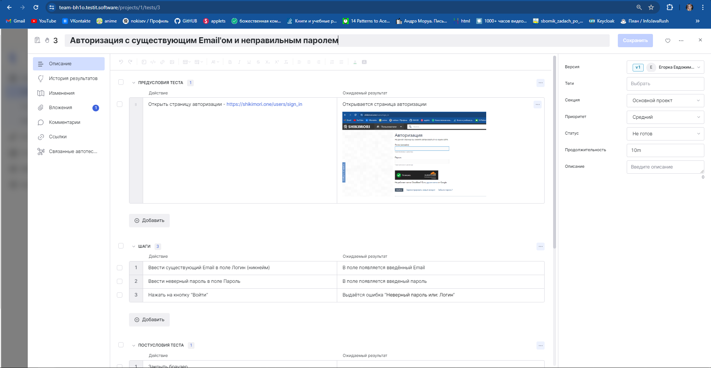
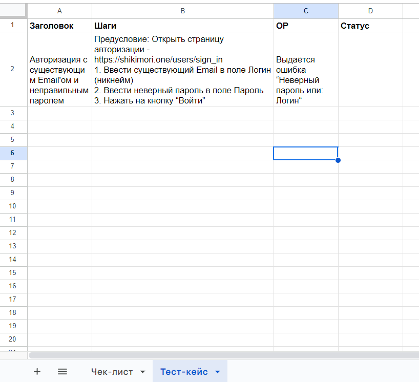

### ***13/05/2024***
### <a name="first">Основы тестирования: краш-курс</a> (https://stepik.org/course/203539/syllabus)
## 1.2 Что такое тестирование
### Роль тестировщика
Хороший тестировщик - это тот, кто знает, что нужно проверить, чтобы уменьшить риски возникновения проблем. Именно он выявляет потенциальные уязвимости и помогает улучшить качество ПО.
### Ожидание и реальность
Весь процесс тестирования сводится к сопоставлению ОР и ФР.
### Цель тестирования
Цель тестирования заключается в проверке того, насколько ПО соответствует установленным требованиям. Ведь только так мы можем быть уверены в том, что оно выполняет поставленную задачу - и помогает своим пользователям в том виде, в котором это задумывалось...

## 1.3 Требования
Требования - определяют то, что необходимо реализовать, и являются основой работы не только тестировщиков, но и других участников процесса разработки, таких как разработчики, аналитики и маркетологи.
### Определение требований
Требования - это описание функциональности или особненностей продукта, которые необходимо реализовать. Обычно они содержат информацию о том, что должно быть сделано, но не углубляются в детали тех. реализации.
### Характеристики хороших требований
Хорошие требования - это те, после которых нет никаких вопросов о том, что именно нужно сделать. Они чётко определяют ОР.
### Роль тестировщика в оценке требований
Тестировщик играет важную роль в обнаружении неточностей или недостатков в требованиях. Именно он старается выявить потенциальные проблемы ещё на жтмапе формулировки требований, чтобы избежать неприятных сюрпризов в дальнейшем.

## 1.4 Баги
### Определение ошибки
Ошибка, или "баг", это несоответствие ФР > ОР.
### Происхождение термина "баг"
Одна из версий связывает его с английским словом "bug", что переводится как "мелкая букашка" или "жук". Легенда гласит, что в 1945 году учёные Гарвардского университета испытывали один из вычислительных приборов, но устройство не работало. После расследования они обнаружили застрявшую между проводами бабочку, которую извлекли из аппарата. Это событие было зафиксировано в их дневнике, и с тех пор слово "баг" стало означать "ошибку".

## 2.1 Чек-лист
Чек-лист представляет собой список коротких проверок, обеспечивающих представление о том, что нужно протестировать без детализации и углубления в суть. Он является одним из самых популярных видов тестовой документации, помогающей тестировщикам организовать процесс тестирования. Был рассмотрен процесс создания чек-листа на примере проверки формы авторизации на сайте "shikimori".
1. Валидная авторизация
    - Проверка возможности авторизации на сайте, используя действительный Email и пароль.
2. Авторизация с несуществующим Email'ом и правильным паролем.
    - Проверка реакции системы на попытку авторизации с недействительным Email и действительным паролем.
3. Авторизация с существующим Email'ом и неправильным паролем.
    - Проверка системы на корректное обработку ввода действительного Email и недействительного пароля.
4. Авторизация с несуществующим Email'ом и неправильным паролем.
    - Проверка системы на обработку недействительных учетных данных при попытке авторизации.
5. Отображение ошибки при некорректном вводе данных.
    - Проверка наличия информативного сообщения об ошибке при неправильном вводе учетных данных.
Есть позитивное тестирование, где мы проверяем, что система корректно обрабатывает правильные данные. Тем не менее, также важно провести негативное тестирование, проверив систему на обработку неверных данных.

Статусы для проверок:
- Passed: Тест пройден успешно.
- Failed: Тест провален.
- Blocked: Не получилось начать выполнение теста из-за других проблем.
- Skipped: Проверка пропущена в рамках данного цикла тестирования.

Этот подход помогает организовать процесс тестирования и эффективно отслеживать прогресс прохождения тест-сьюта (набора тест-кейсов).

Скрин практики:

## 2.2 Тест-кейсы
Тест-кейс представляет собой подробное описание последовательности шагов для достижения определённого результата. В отличие от чек-листа, он включает в себя не только название проверки, но и действия, которые необходимо выполнить, а также ОР.

_Пример:_ 

Тест-кейс помогает структурировать процесс тестирования и обеспечить однозначное понимания того, что и как проверять. Он включает в себя не только действия, но и предусловия, постусловия и ОР, что делает его полным описанием теста.

## 2.3 Баг-репорты
### Что такое баг-репорт?
Баг-репорт - это документ, который сообщает команде о наличии ошибок в программном продукте и содержит информацию о том, как воспроизвести эту ошибку.
- Структура баг-репорта:
    - Заголовок: Определяет суть поблемы. (принцип Что? Где? Как воспроизвести?)
    - Предусловие: Условия, необходимые для воспроизведения бага.
    - Шаги: Описывают последовательность действий для воспроизведения бага.
    - ОР: Что ожидалось в результате выполнения шагов.
    - ФР: Что произошло на самом деле.
    - Доп. инфа: Окружение, скрины, видео и т.д.
### Какие стадии проходит баг?
- To Do - свжеиспеченный баг, ждёт пока его возьмут на работу
- In Progress - здесь баг правят
- Review - исправление бага проверят разрабы (его код)
- Ready for Testing - здесь баг ждёт повторной проверки тестировщиками
- Testing - тестировщик проверяет
    - Если баг исправлен, задача закрывается
    - Если баг всё ещё воспроизводится, задача возвращается в разработку (To Do) 
## 3.1 И что дальше?
### Продолжение
- Подробная теория тестирования (циклы разработки ПО, методологии, виды тестирования и пр.)
- Работа со снифферами для анализа трафика (Fiddler, Charles)
- Работа с браузерными инстркументами разработчика (Devtools)
- Тестирование API (и использование Postman)
- Работа с консолью
- Тестирование баз данных (и язык запросов SQL)
------
